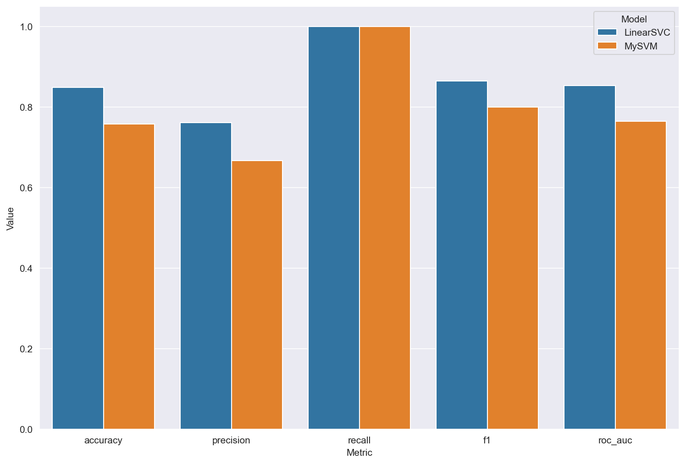

# Проект: Реализация SVM с нуля (MySVM)

## Введение

Проект реализует алгоритм **метода опорных векторов (SVM)** на Python без использования готовых библиотек машинного обучения.
Особенности реализации:

* Обучение с помощью стохастического градиентного спуска (SGD)
* Поддержка параметра регуляризации $C$
* Возможность задания подвыборки для ускорения обучения (`sgd_sample`)
* Воспроизводимость результатов через `random_state`
* Реализация hinge loss с L2-регуляризацией

**Цель проекта:** изучение принципов работы метода опорных векторов и практическая реализация алгоритма с нуля.
**Актуальность:** SVM широко используется для решения задач классификации, особенно на малых выборках и при высокой размерности признаков.

---

## Теоретическая часть

### Модель SVM

Задача SVM заключается в нахождении разделяющей гиперплоскости:

$$
f(x) = w^T x + b
$$

* $w$ — вектор весов
* $b$ — смещение
* $x$ — вектор признаков

Модель принимает решение по правилу:

$$
\hat{y} = \text{sign}(w^T x + b)
$$

### Функция потерь (hinge loss)

Для SVM используется функция потерь вида:

$$
L(w, b) = \frac{1}{n} \sum_{i=1}^{n} \max(0, 1 - y_i (w^T x_i + b)) + \lambda \|w\|^2
$$

Где:

* $\max(0, 1 - y_i (w^T x_i + b))$ — hinge loss (штраф за неверную классификацию или нахождение внутри зазора)
* $\lambda \|w\|^2$ — L2-регуляризация, контролирующая сложность модели

---

## Реализация (MySVM)

Класс `MySVM` поддерживает следующие параметры:

| Параметр       | Тип       | Описание                                  |
| -------------- | --------- | ----------------------------------------- |
| n\_iter        | int       | Количество итераций обучения              |
| learning\_rate | float     | Скорость обучения                         |
| C              | float     | Параметр регуляризации (жёсткость штрафа) |
| sgd\_sample    | int/float | Размер подвыборки для SGD                 |
| random\_state  | int       | Фиксатор случайности                      |

---

## Сравнение со встроенной реализацией
При настройке моделей использовались одинаковые параметры. Сравнение было проведено на одном и том же наборе данных. По результатам этого сравнения можно сделать вывод, что собственная реализация выполнена достаточно хорошо

## Сравнение работы градиентного спуска и стохастического градиентного спуска

| Характеристика               | Полный градиентный спуск (GD) | Стохастический градиентный спуск (SGD) |
| ---------------------------- | ----------------------------- | -------------------------------------- |
| Работа с данными             | Использует весь датасет       | Использует случайную подвыборку        |
| Скорость на маленьких данных | Быстрая сходимость            | Медленнее из-за случайности            |
| Скорость на больших данных   | Очень дорогой по вычислениям  | Быстрее, особенно при больших выборках |
| Сходимость                   | Стабильная, гладкая           | Колеблющаяся, но достигает минимума    |
| Риск переобучения            | Выше                          | Ниже благодаря шуму                    |
| Применимость                 | Малые/средние данные          | Большие наборы, потоковые данные       |

